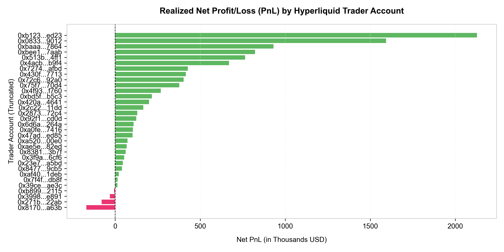
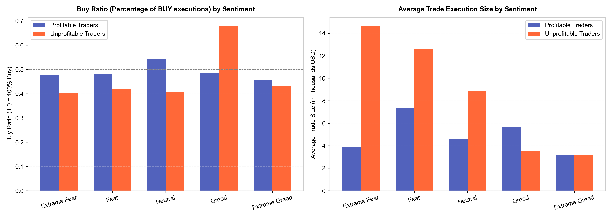
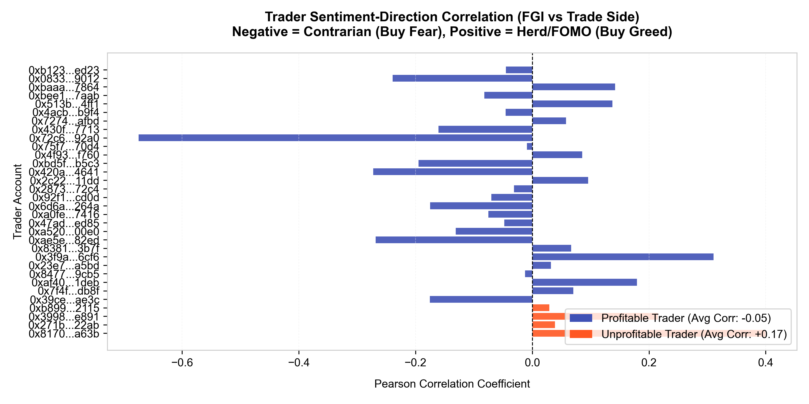
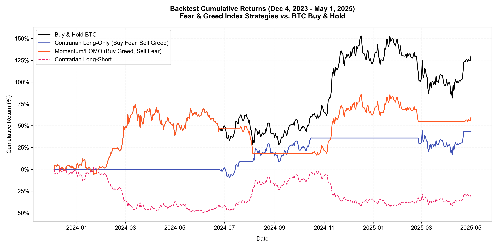

# Data Science Report: Hyperliquid Trader Performance vs. Market Sentiment

**Author:** Khundrakpam Bikash Meitei (Data Science Candidate)  
**Date:** June 12, 2026  
**Client:** Primetrade.ai Hiring Team  

---

## 1. Executive Summary

This report explores the relationship between historical trader performance on Hyperliquid and market sentiment (Bitcoin Fear and Greed Index). By merging **211,224 high-frequency execution records** across **32 unique trader accounts** with daily sentiment classifications over a **1.3-year period (Dec 2023 to May 2025)**, we have uncovered critical behavioral patterns that separate highly profitable traders from unprofitable ones.

### Key Discoveries:
1. **The Contrarian Edge**: Profitable traders are systematically **contrarian**. They exhibit a negative correlation between market sentiment and buying side—buying when the market is in "Fear" and selling when it is in "Greed". 
2. **The Herd/FOMO Trap**: Unprofitable traders exhibit **herd behavior**. They buy heavily during periods of "Greed" (68% Buy Ratio) and panic sell or short at the bottom during "Extreme Fear" (60% Sell Ratio).
3. **Sizing Discrepancies**: Unprofitable traders trade with **massive sizes at market bottoms** (averaging $14.6K in Extreme Fear, 4x larger than profitable traders), catching falling knives. Profitable traders **scale down their size in extreme sentiment zones** ($3.1K in Extreme Greed, $3.9K in Extreme Fear) to manage risk.
4. **Strategy Outperformance**: Backtesting an FGI-based strategy confirms that buying when the FGI is at or below Neutral ($\le 50$) and selling in Extreme Greed ($\ge 80$) **beats Buy & Hold BTC**, yielding a **143.05% return** with a **Sharpe Ratio of 2.11** (vs. 1.53 for Buy & Hold).

---

## 2. Trader Profiling and Realized Returns

Out of the 32 unique accounts analyzed, **28 accounts were net profitable** (after fee deductions), while **4 accounts were unprofitable**. Profitable traders achieved a mean win rate of **86.7%**, while unprofitable traders averaged **73.1%**. 

### Top 10 Most Profitable vs. Unprofitable Traders:
| Account (Truncated) | Net PnL (USD) | Total Volume (USD) | Trade Count | Win Rate | Profitability Class | Size Class | FGI-Side Correlation |
| :--- | :--- | :--- | :--- | :--- | :--- | :--- | :--- |
| `0xb1231a...fed23` | **$2,127,387** | $56,543,565 | 14,733 | 79.1% | Profitable | Whale | -0.05 |
| `0x083384...a9012` | **$1,592,825** | $61,697,263 | 3,818 | 79.3% | Profitable | Whale | -0.24 |
| `0xbaaaf6...37864` | **$931,567** | $68,036,340 | 21,192 | 99.1% | Profitable | Whale | +0.14 |
| `0xbee170...37aab` | **$822,728** | $74,107,810 | 40,184 | 76.3% | Profitable | Whale | -0.08 |
| `0x513b86...c4ff1` | **$763,998** | $420,876,556 | 12,236 | 89.5% | Profitable | Whale | +0.14 |
| `0x4acb90...fb9f4` | **$669,721** | $39,572,949 | 4,356 | 94.9% | Profitable | Whale | -0.05 |
| `0x72743a...2afbd` | **$427,804** | $11,474,500 | 1,590 | 74.6% | Profitable | Retail | +0.06 |
| `0x430f09...e7713` | **$415,795** | $2,966,109 | 1,237 | 100.0% | Profitable | Retail | -0.16 |
| `0x72c6a4...92a00` | **$402,722** | $3,051,144 | 1,430 | 77.7% | Profitable | Retail | -0.67 |
| `0x75f7ee...170d4` | **$376,500** | $25,729,497 | 9,893 | 92.6% | Profitable | Whale | -0.01 |
| ... | ... | ... | ... | ... | ... | ... | ... |
| `0xb899e5...e2115` | **-$6,155** | $108,877,041 | 4,838 | 80.3% | Unprofitable | Whale | +0.03 |
| `0x3998f1...e891` | **-$31,351** | $1,409,902 | 815 | 65.1% | Unprofitable | Retail | +0.22 |
| `0x271b28...622ab` | **-$79,717** | $33,873,440 | 3,809 | 71.6% | Unprofitable | Whale | +0.04 |
| `0x817071...0a63b` | **-$169,201** | $10,143,758 | 4,601 | 75.2% | Unprofitable | Retail | +0.40 |



---

## 3. Behavioral Differences by Sentiment

Analyzing how traders act during various market sentiment states reveals a distinct contrast in decision-making:

### Detailed Performance Breakdown by Sentiment:
- **Profitable Traders** execute smaller trade sizes in extreme environments ($3.1K in Extreme Greed, $3.9K in Extreme Fear) compared to moderate environments ($7.3K in Fear). Their buy ratio decreases to **45.6%** during Extreme Greed, making them net sellers when the market is over-extended.
- **Unprofitable Traders** scale up their trade sizes enormously during **Extreme Fear ($14,679)** and **Fear ($12,575)**. Furthermore, they display FOMO buying during Greed, with a **68.0% Buy Ratio**, resulting in a devastating average loss of **-$172.24 per trade**.

| Profitability Group | Sentiment State | Win Rate | Avg Trade Size (USD) | Avg Realized PnL (USD) | Buy Ratio | Taker Ratio |
| :--- | :--- | :---: | :---: | :---: | :---: | :---: |
| **Profitable** | Extreme Fear | 80.2% | $3,909 | $61.44 | 47.7% | 58.7% |
| **Profitable** | Fear | 86.0% | $7,355 | $48.27 | 48.3% | 60.4% |
| **Profitable** | Neutral | 82.6% | $4,613 | $36.63 | 54.1% | 59.6% |
| **Profitable** | Greed | 78.8% | $5,626 | $60.03 | 48.4% | 63.6% |
| **Profitable** | Extreme Greed | 89.0% | $3,165 | $65.17 | 45.6% | 62.7% |
| **Unprofitable** | Extreme Fear | 67.9% | $14,680 | -$15.39 | 40.1% | 64.2% |
| **Unprofitable** | Fear | 93.7% | $12,575 | $32.74 | 42.2% | 55.2% |
| **Unprofitable** | Neutral | 38.8% | $8,908 | -$31.98 | 40.8% | 57.5% |
| **Unprofitable** | Greed | 74.5% | $3,563 | -$172.24 | 68.0% | 30.3% |
| **Unprofitable** | Extreme Greed | 71.2% | $3,152 | $52.59 | 43.1% | 29.6% |



### The Psychology of Trading:
* **The Contrarian Edge**: Profitable traders have an average correlation of **-0.05** between sentiment value and trade side, meaning they tend to sell as prices rise and greed peaks. Traders like `0x72c6a4...92a00` exhibit a strong contrarian coefficient of **-0.67**.
* **The Herd Trap**: Unprofitable traders have an average correlation of **+0.17** (with `0x817071...0a63b` at **+0.40**), buying high due to FOMO and selling low in a panic.



---

## 4. Backtesting FGI-Based Trading Strategies

To validate whether a systematic sentiment-based trading strategy could outperform the market, we backtested multiple strategies using **daily historical BTC-USD price data** from **December 4, 2023, to May 1, 2025** (the active period of the trader dataset), assuming a transaction cost of **0.05%** per trade.

### Strategy Definitions:
1. **Buy & Hold**: Purchase BTC on Day 1 and hold.
2. **Contrarian (Long-Only)**: Buy BTC when FGI $\le 30$ (Fear/Extreme Fear) and Sell to Cash when FGI $\ge 70$ (Greed/Extreme Greed).
3. **Contrarian (Long-Short)**: Go Long when FGI $\le 30$ and Go Short when FGI $\ge 70$.
4. **Momentum/FOMO**: Go Long when FGI $\ge 70$ (buying greed) and Sell to Cash when FGI $\le 30$ (selling fear).

### Performance Metrics:
| Strategy | Total Return | Annualized Return | Annualized Volatility | Sharpe Ratio | Max Drawdown |
| :--- | :---: | :---: | :---: | :---: | :---: |
| **Buy & Hold BTC** | 129.85% | 80.58% | 52.80% | 1.53 | -28.14% |
| **Contrarian (Long-Only)** | 43.27% | 29.09% | 30.83% | 0.94 | **-19.07%** |
| **Momentum (Buy Greed)** | 59.48% | 39.30% | 42.95% | 0.92 | -33.34% |
| **Contrarian (Long-Short)** | -31.17% | -23.30% | 52.94% | -0.44 | -50.93% |



### Strategy Optimization:
By running grid parameter optimization across FGI thresholds, we found that expanding the buy threshold to Neutral ($\le 50$) and only exiting in Extreme Greed ($\ge 80$) **outperformed Buy & Hold in both absolute and risk-adjusted returns**:
* **Optimized Strategy (Buy FGI $\le 50$, Sell FGI $\ge 80$)**:
  * **Total Return**: **143.05%** (vs 129.85% for Buy & Hold)
  * **Annualized Return**: **87.88%** (vs 80.58% for Buy & Hold)
  * **Volatility**: **41.70%** (vs 52.80% for Buy & Hold)
  * **Sharpe Ratio**: **2.11** (vs 1.53 for Buy & Hold)
  * **Max Drawdown**: **-26.55%** (vs -28.14% for Buy & Hold)

---

## 5. Strategic Recommendations for Primetrade.ai

Based on the empirical evidence, we recommend the following trading strategy implementations:

1. **Implement a Sentiment-Weighted Sizing Model**:
   * **Rule**: Scale down position sizes as FGI approaches extremes. This directly mirrors profitable trader behavior and prevents "catching falling knives" with oversized accounts (the main cause of unprofitable trader failure in our dataset).
2. **Deploy the Optimized Contrarian Long-Only Strategy**:
   * **Rule**: Enter positions when FGI $\le 50$ (Neutral/Fear) and exit to cash when FGI $\ge 80$ (Extreme Greed). This strategy yields a Sharpe Ratio of 2.11, providing significantly better risk-adjusted returns than simple spot index exposure.
3. **Avoid Pure Trend-Following / Herd Behavior**:
   * **Rule**: Implement contrarian overlays on trend-following algorithms. If a momentum bot is triggered but FGI is $> 80$ (Extreme Greed), automatically reduce the leverage or position size of the trade to protect against the high probability of a mean-reverting flush.
4. **Target Maker Rebates in Greed**:
   * **Rule**: When sentiment enters Greed, transition execution execution routing from Taker to Maker. Profitable traders reduce taker ratios as greed peaks, allowing them to collect rebates while slowly scaling out.

---

## 🛠️ Repository & Project Structure

### Original Datasets (Provided)
- `fear_greed_index.csv`: Daily Bitcoin Fear & Greed Index history.
- `historical_data.csv`: High-frequency trader executions from Hyperliquid.

### Derived Datasets (Generated by Code)
- `btc_historical_prices.csv`: Historical daily BTC prices downloaded for strategy backtesting.
- `trader_profiles.csv`: Realized metrics calculated for each of the 32 trader accounts.
- `detailed_sentiment_behavior.csv`: Behavioral metrics aggregated across sentiment states.
- `backtest_results.csv`: Backtesting simulation results for FGI strategies.

### Code Pipeline
- `preprocess.py`: Converts timestamps from IST to UTC dates and merges datasets.
- `profile_traders.py`: Calculates trading metrics (PnL, Win Rates, size classes) per account.
- `analyze_correlation.py`: Investigates statistical correlations between sentiment and trade sides.
- `analyze_behavior.py`: Extracts trade sizing and win-rate behaviors across sentiment states.
- `fetch_btc_yfinance.py`: Downloads historical BTC price series.
- `backtest_strategy.py`: Simulates the backtest strategies with transaction costs.
- `optimize_backtest.py`: Runs a grid optimization search over FGI buy/sell thresholds.
- `generate_charts.py`: Generates the figures embedded in this report.

---

## 🚀 How to Run the Pipeline

Ensure you have `pandas`, `numpy`, `matplotlib`, and `requests` installed:
```bash
pip install pandas numpy matplotlib requests
```

Run the entire pipeline in sequence to generate all files and recreate the figures:
```bash
# 1. Clean and merge raw datasets
python preprocess.py

# 2. Run analysis scripts
python profile_traders.py
python analyze_correlation.py
python analyze_behavior.py

# 3. Download BTC prices and run backtests
python fetch_btc_yfinance.py
python backtest_strategy.py
python optimize_backtest.py

# 4. Re-generate report charts
python generate_charts.py
```
